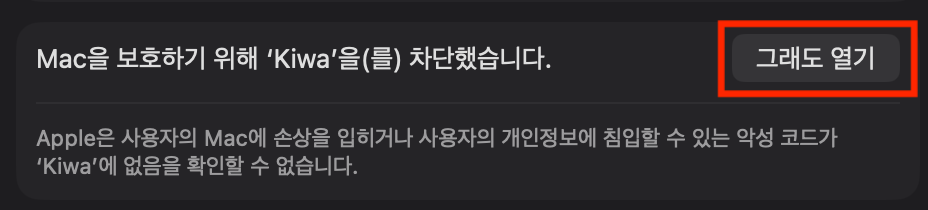

# Kiwa

[](https://github.com/kudosmax/Kiwa/releases)

[English](./README.md) | **한국어**

Kiwa는 지식 생산자를 위한 기호 입력 도구입니다. 단축키 하나로 학술 인용 부호와 특수 문자를 빠르게 삽입할 수 있습니다.

macOS Sonoma 14 이상에서 동작합니다.

<br clear="both" />

<!-- vim-markdown-toc GFM -->

* [기능](#기능)
* [설치](#설치)
* [사용법](#사용법)
* [기본 기호](#기본-기호)
* [고급 설정](#고급-설정)
  * [기호 커스터마이즈](#기호-커스터마이즈)
  * [전역 단축키 변경](#전역-단축키-변경)
  * [언어 변경](#언어-변경)
* [FAQ](#faq)
  * [기호가 삽입되지 않아요](#기호가-삽입되지-않아요)
  * [단축키를 눌러도 패널이 나타나지 않아요](#단축키를-눌러도-패널이-나타나지-않아요)
  * [커스텀 기호는 어떻게 추가하나요?](#커스텀-기호는-어떻게-추가하나요)
  * [Kiwa가 Dock에 나타나지 않아요](#kiwa가-dock에-나타나지-않아요)
* [만든 이유](#만든-이유)
* [라이선스](#라이선스)

<!-- vim-markdown-toc -->

## 기능

* 가볍고 빠른 동작
* 키보드 중심 조작
* 선택한 기호를 클립보드에 즉시 복사
* 최대 9개 기호 슬롯 커스터마이즈
* 네이티브 macOS UI
* 한국어 / 영어 지원

## 설치

[릴리스](https://github.com/kudosmax/Kiwa/releases/latest) 페이지에서 최신 버전을 다운로드하거나, Homebrew를 사용하세요:

```sh
brew install --cask kiwa # 준비 중
```

> [!WARNING]
> Kiwa는 Apple 공증을 받지 않았기 때문에 처음 실행 시 macOS가 차단할 수 있습니다. 허용하려면:
>
> 1. **시스템 설정 > 개인정보 보호 및 보안**으로 이동합니다.
> 2. 아래로 스크롤하여 *"Mac을 보호하기 위해 'Kiwa'을(를) 차단했습니다."* 메시지를 찾습니다.
> 3. **"그래도 열기"**를 클릭합니다.
>
> 

## 사용법

1. <kbd>SHIFT (⇧)</kbd> + <kbd>OPTION (⌥)</kbd> + <kbd>D</kbd>를 눌러 Kiwa 패널을 열거나, 메뉴바 아이콘을 클릭합니다.
2. <kbd>⌘1</kbd>~<kbd>⌘9</kbd> 키로 기호를 선택합니다.
3. 기호가 클립보드에 복사되고 패널이 자동으로 닫힙니다.
4. <kbd>⌘V</kbd>로 원하는 곳에 붙여넣습니다.
5. 패널을 닫으려면 <kbd>ESC</kbd>를 누르거나 패널 바깥을 클릭합니다.
6. 동작을 커스터마이즈하려면 <kbd>COMMAND (⌘)</kbd> + <kbd>,</kbd>로 설정을 엽니다.

## 기본 기호

| 키 | 기호 | 용도 |
|----|------|------|
| 1 | 「」 | 논문 제목 |
| 2 | 『』 | 단행본 제목 |
| 3 | 〈〉 | 작품 / 시 제목 |
| 4 | 《》 | 영화 / 앨범 제목 |
| 5 | “” | 인용 |
| 6 | ‘’ | 강조 |
| 7 | — | 줄표 (em dash) |
| 8 | · | 가운뎃점 |
| 9 | …… | 말줄임표 |

## 고급 설정

### 기호 커스터마이즈

설정에서 각 슬롯의 기호를 변경할 수 있습니다:

1. <kbd>COMMAND (⌘)</kbd> + <kbd>,</kbd>로 설정을 엽니다.
2. "기호 설정" 섹션에서 여는 기호, 닫는 기호, 라벨을 편집합니다.
3. 닫는 기호를 비워두면 단일 기호로 동작합니다.
4. 내장된 프리셋 선택기로 16가지 조판 기호 중 빠르게 선택할 수 있습니다.

### 전역 단축키 변경

기본 단축키 <kbd>⇧</kbd> + <kbd>⌥</kbd> + <kbd>D</kbd>를 변경하려면:

1. 설정을 엽니다.
2. "단축키" 섹션에서 "변경" 버튼을 클릭합니다.
3. 원하는 키 조합을 누릅니다.

### 언어 변경

Kiwa는 한국어와 영어를 지원합니다. 앱 언어를 변경하려면:

1. 설정을 엽니다.
2. "언어" 드롭다운에서 원하는 언어를 선택합니다.
3. 안내에 따라 앱을 재시작합니다.

## FAQ

### 기호가 삽입되지 않아요

1. 시스템 설정 > 개인정보 보호 및 보안 > 손쉬운 사용에 "Kiwa"가 추가되어 있는지 확인하세요.
2. 권한을 부여한 후 Kiwa를 재시작해야 할 수 있습니다.

### 단축키를 눌러도 패널이 나타나지 않아요

1. Kiwa가 메뉴바에서 실행 중인지 확인하세요.
2. 단축키가 다른 앱과 충돌하지 않는지 확인하세요.
3. 시스템 설정 > 개인정보 보호 및 보안 > 손쉬운 사용에서 Kiwa의 권한을 확인하세요.

### 커스텀 기호는 어떻게 추가하나요?

설정에서 "+ 기호 추가" 버튼을 클릭하여 새 기호를 추가할 수 있습니다. 최대 9개까지 등록 가능합니다.

### Kiwa가 Dock에 나타나지 않아요

Kiwa는 메뉴바 앱입니다. 백그라운드에서 실행되며 메뉴바에만 표시됩니다. 가볍게 유지하기 위한 의도적인 설계입니다.

## 만든 이유

한국어 학술 글쓰기에서는 『』, 「」, 《》 등 다양한 조판 인용 부호를 사용합니다. 하지만 이 기호들은 macOS 표준 키보드에 없습니다. 매번 특수 문자 뷰어를 열거나 복사-붙여넣기를 하는 것은 번거롭고 글쓰기 흐름을 끊습니다.

Kiwa는 이 문제를 해결하기 위해 만들었습니다. 단축키 하나로 자주 사용하는 인용 부호를 클립보드에 빠르게 복사하고, 바로 붙여넣을 수 있습니다.

## 라이선스

[MIT](./LICENSE)
